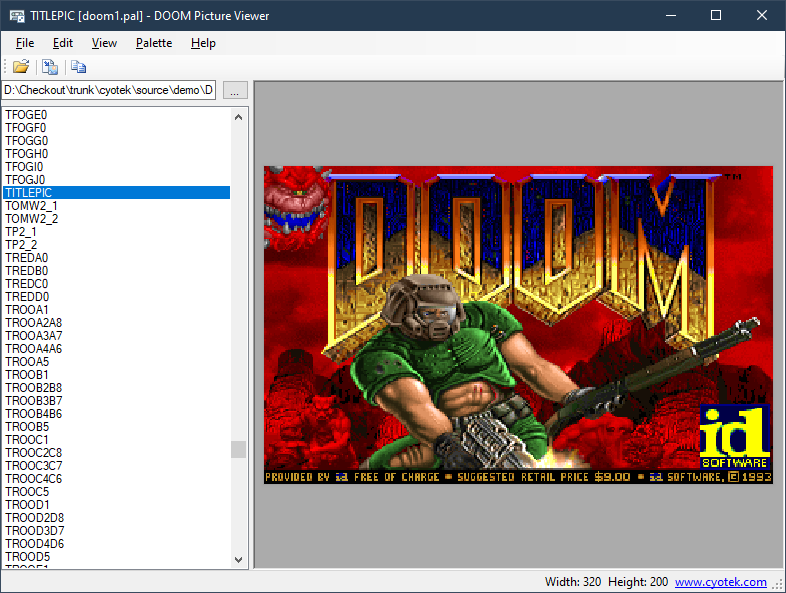

# Decoding DOOM Picture Files

This repository contains a simple application that can decode
the picture lumps extracted from a DOOM WAD.

For more information, please see the following article on the
Cyotek blog:

* [Decoding DOOM picture files](https://www.cyotek.com/blog/decoding-doom-picture-files)

